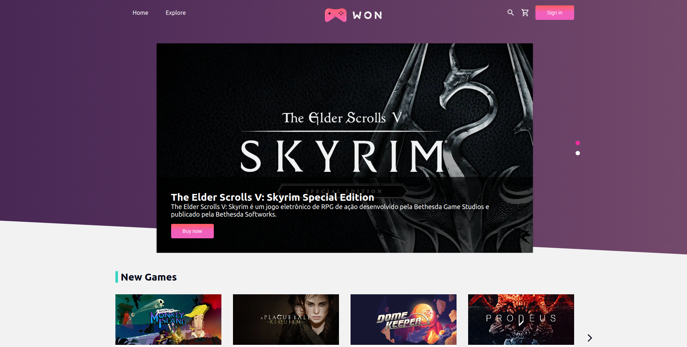

<br/>
<p align="center">
  <a href="https://github.com/JohannesAlves/won-games">
    
  </a>

  <h3 align="center">Won Games</h3>

  <p align="center">
    A Won Games é um projeto para estudo de tecnologias, baseado em um e-commerce real com formas de pagamento, experiência imersiva do cliente, painel administrativo, login e etc..
    <br/>
    <br/>
  </p>
</p>

  

## About The Project



<strong>Explorar e Comprar Jogos:</strong> Os clientes poderão explorar uma vasta seleção de jogos, filtrar por categorias e plataformas, adicionar jogos ao carrinho de compras e, finalmente, comprar seus jogos favoritos com facilidade.

<strong>Gerenciar Conta: </strong> A Won Games fornecerá uma área do cliente onde os usuários podem gerenciar suas informações pessoais, visualizar histórico de compras e acompanhar pedidos atuais.

<strong>Administração Completa:</strong> Os administradores da plataforma terão acesso a um CMS (Sistema de Gerenciamento de Conteúdo) personalizado que permitirá a adição de produtos, categorias, plataformas, criação de promoções, edição do site e configuração de e-mails automatizados para notificar os clientes sobre vendas e produtos.

A arquitetura do projeto é robusta e utiliza uma variedade de tecnologias modernas, incluindo:

<strong>Front-end:</strong> Utiliza tecnologias populares como ReactJS e Next.js, garantindo uma experiência de usuário eficaz e responsiva.

<strong>Qualidade de Código:</strong> A qualidade do código é enfatizada com a implementação de testes em todo o projeto. Ferramentas como Eslint, Prettier e Git hooks são usadas para manter o código organizado e limpo.

<strong>Back-end/CMS: </strong> O Strapi é escolhido como a base para o back-end e CMS da Won Games. O Strapi oferece flexibilidade para criar e gerenciar conteúdo, incluindo a personalização do CMS para atender às necessidades específicas da loja.

<strong>GraphQL: </strong> A API GraphQL é implementada para permitir consultas flexíveis e eficientes, incluindo queries, filtros e mutations.

<strong>Testes e Storybook:</strong> A etapa de desenvolvimento inclui a criação de componentes com Styled Components, testes e cenários no Storybook, garantindo a qualidade e a consistência visual.

<strong>Testes E2E:</strong> São realizados testes de integração E2E para garantir a qualidade e a funcionalidade do site em todos os cenários de uso.

<strong>CI e Deploy:</strong> Um processo de integração contínua (CI) é estabelecido para automatizar o processo de implantação em produção, garantindo que o site esteja sempre atualizado e funcional.

## Built With

Next.JS, Styled-Components, Jest, Storybook, Cypress (E2E), GraphQL e TypeScript.

## Getting Started

Gostaria de ver o projeto? segue abaixo as orientações necessárias para executar.

### Installation

1. Clone o repositório

```sh
https://github.com/JohannesAlves/won-games.git
```

2. Instale as dependências

```sh
yarn --ignore-engines
```


